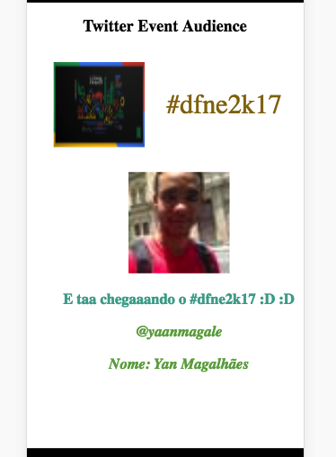

# Event Present Audience

A app to show tweets what people saying about your event

# How it works
This project using a Polymer to create a Web Components

For catch data, this app uses a [Twitter Event Audience](https://github.com/yanmagale/twitter-event-audience) to get Tweets Data

# Setup
- You need  that Polymer CLI has installed globally
- Clone this project
- Run `bower i`

## Documentation
- Open `documentation.html` to see all docs this component

# Customize Template

You can customize properties that template utilize for show tweets data. This is possibily because this template using a `CSS Custom Properties`

> API

```
 --color-message: Set a color for tweet message
 --color-tag: Set a color for custom tag
 --color-information: Set a color for user that send this message

 ```

 ## Setting Your Hashtag
 - In `getTweets()` you need pass what hastag that `Twitter Event Audience` used to get your tweets.

 > Example

 ``` 
    http://yourserviceadress/event-audience?hashtag=myawesomeevent

 ```   

# How to Use

## Ofline
- You need  that Polymer CLI has installed globally
- Run `polymer serve --open` to open a new browser page with this app 

## Online
*Waiting for Next Changes*

> A both of cases, you will see this template like this:



# Raflle Gifts
- This template get random tweet for raflle gifts in your event.


# How To Contribute?

Everyone can help, feel free to open a  issue, or by a PR.